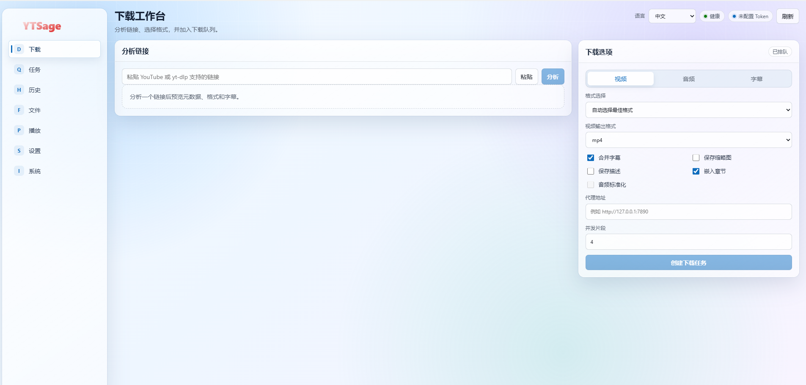

<div align="center">


# YTSage

**Self-hosted yt-dlp download server with a modern Web UI.**

This fork is based on the upstream [oop7/YTSage](https://github.com/oop7/YTSage) project and has been adapted toward a self-hosted Web service workflow.

Analyze media links, download video/audio/subtitles, manage playlists and tasks, browse downloaded files, and play local media from the browser.



[](https://www.python.org/downloads/)
[](https://fastapi.tiangolo.com/)
[](https://react.dev/)
[](https://opensource.org/licenses/MIT)

<a href="#features">Features</a> -
<a href="#quick-start">Quick Start</a> -
<a href="#configuration">Configuration</a> -
<a href="#development">Development</a> -
<a href="#api">API</a> -
<a href="#troubleshooting">Troubleshooting</a>

</div>

---

<a id="overview"></a>
## Overview

YTSage is now focused on the service-side experience: a FastAPI server, a built React Web UI, persistent task/history storage, and local media management around `yt-dlp` and `ffmpeg`.

The default package entry point starts the Web service. The UI is served by the backend, so after starting the server you use YTSage from a browser instead of a desktop window.

Current stack:

- Backend: FastAPI, Uvicorn, Pydantic, SQLite storage
- Downloader: yt-dlp
- Media processing: ffmpeg, provided through `imageio-ffmpeg` when needed
- Frontend: React, Vite, ArtPlayer
- Runtime settings: environment variables plus `server-settings.json`

<a id="features"></a>
## Features

### Download Workspace

- Analyze URLs supported by yt-dlp.
- Download video, audio, or subtitles.
- Select a format from the analyzed format list.
- Choose video container: `mp4`, `webm`, `mkv`.
- Choose audio output: `mp3`, `m4a`, `opus`, `flac`, `wav`.
- Select subtitle languages from the analysis result.
- Merge subtitles, save thumbnails, save descriptions, embed chapters, and normalize audio.
- Configure proxy URL per task.
- Configure concurrent fragment downloads per task.
- Use service default video resolution for automatic format selection.

### Playlist Handling

- Analyze playlists and select specific entries before creating a task.
- Playlist pagination with direct page numbers.
- Per-entry task status: pending, downloading, downloaded, failed.
- Playlist downloads continue after individual item failures when supported by yt-dlp.
- Retry a failed playlist item inside the original task record.

### Task And History Management

- Queue-based task execution with configurable concurrency.
- Realtime task updates through WebSocket plus polling fallback.
- Cancel, delete, and clear finished task records.
- Completed and failed downloads are stored in history.
- Interrupted tasks are marked after server restart.

### File Library

- Browse the download root as a left folder tree and right media table.
- Search and paginate media files.
- Download individual files with HTTP Range support.
- Download a selected folder as a ZIP archive.
- Export folder manifests as `aria2`, `txt`, or `json`.
- aria2 manifests include multi-connection options for resumable batch downloads.

### Playback Page

- Dedicated playback page separate from the file browser.
- YouTube-style layout with a main player and right-side playlist.
- Select a download directory as the playback queue source.
- Play local video and audio files through ArtPlayer.
- In-player controls include speed selection, fullscreen, web fullscreen, hotkeys, and PiP for video.

### Settings And System

- Save filename template presets or a custom yt-dlp output template.
- Save default video resolution.
- Manage cookies for default, Bilibili, and YouTube profiles.
- View server health, download/config paths, queue concurrency, auth status, yt-dlp version, and ffmpeg status.
- Install or update runtime dependencies from the system page.

<a id="quick-start"></a>
## Quick Start

### Install From PyPI

```bash
pip install ytsage
```

Start the server:

```bash
ytsage
```

Open the Web UI:

```text
http://127.0.0.1:8080
```

### Run From Source

```bash
git clone https://github.com/oop7/YTSage.git
cd YTSage
pip install .
ytsage
```

You can also run the server module directly:

```bash
python -m ytsage.server.app
```

<a id="configuration"></a>
## Configuration

YTSage reads configuration from environment variables. For local development, it also loads a project-root `.env` file without overriding variables already set in the shell.

Create a local `.env` file:

```powershell
Copy-Item .env.example .env
```

Default `.env.example`:

```text
YTSAGE_CONFIG_DIR=.dev-data/config
YTSAGE_DOWNLOAD_DIR=.dev-data/downloads
YTSAGE_QUEUE_CONCURRENCY=2
YTSAGE_HOST=127.0.0.1
YTSAGE_PORT=8080
# YTSAGE_AUTH_TOKEN=change-me
```

Supported variables:

| Variable | Purpose | Default |
|---|---|---|
| `YTSAGE_CONFIG_DIR` | Config, database, cookies, and service settings directory | platform config path |
| `YTSAGE_DOWNLOAD_DIR` | Download output directory | user Downloads/YTSage |
| `YTSAGE_QUEUE_CONCURRENCY` | Number of concurrent worker tasks | `2` |
| `YTSAGE_HOST` | Server bind host | `127.0.0.1` |
| `YTSAGE_PORT` | Server port | `8080` |
| `YTSAGE_AUTH_TOKEN` | Optional bearer token for API/UI access | unset |
| `YTSAGE_AUTO_INSTALL_DEPS` | Auto-install missing yt-dlp/ffmpeg helpers on startup | `1` |

Persistent UI settings are stored in `server-settings.json` under `YTSAGE_CONFIG_DIR`.

<a id="usage"></a>
## Usage

### Create A Download

1. Open the Web UI.
2. Paste a URL in the Download page.
3. Click Analyze.
4. Choose video, audio, or subtitles.
5. Select output options.
6. For playlists, choose the entries you want from the playlist table.
7. Click Create Download Task.

### Play Downloaded Media

1. Open Files and select a folder.
2. Click Play on a media item, or open the Player page directly.
3. In Player, choose a playback folder to load that folder as the queue.

### Use Folder Manifests

The Files page can export a selected folder as a manifest. The default format is for aria2:

```bash
aria2c -i folder.aria2.txt
```

The manifest contains URLs plus aria2 options such as:

```text
split=8
max-connection-per-server=8
continue=true
```

Other formats are available by changing the URL manually:

```text
/api/folders/manifest?folder=<folder>&format=txt
/api/folders/manifest?folder=<folder>&format=json
/api/folders/manifest?folder=<folder>&format=aria2
```

<a id="development"></a>
## Development

### Backend

Use the helper script on Windows PowerShell:

```powershell
.\scripts\dev-server.ps1
```

Or start manually after creating `.env`:

```bash
python -m ytsage.server.app
```

### Frontend

Install frontend dependencies:

```bash
npm --prefix frontend install
```

Run the Vite dev server:

```bash
npm --prefix frontend run dev
```

Build the production frontend:

```bash
npm --prefix frontend run build
```

The backend serves static files from `ytsage/server/static/`. After frontend changes, copy the build output into the server package static directory:

```bash
rm -rf ytsage/server/static/*
cp -R frontend/dist/* ytsage/server/static/
```

On PowerShell, use the equivalent remove/copy commands.

### Validation

Useful checks before committing:

```bash
python -m py_compile ytsage/server/app.py ytsage/server/models.py ytsage/server/services/download_service.py
npm --prefix frontend run build
```

<a id="api"></a>
## API Overview

Common endpoints:

| Method | Path | Description |
|---|---|---|
| `GET` | `/api/health` | Server, dependency, and path health |
| `GET` | `/api/settings` | Runtime settings visible to the UI |
| `POST` | `/api/settings/filename-template` | Save filename template and default resolution |
| `POST` | `/api/settings/cookies` | Save or clear cookies for a profile |
| `POST` | `/api/dependencies/update` | Update yt-dlp and ffmpeg helper dependencies |
| `POST` | `/api/analyze` | Analyze a media URL |
| `POST` | `/api/tasks` | Create a download task |
| `GET` | `/api/tasks` | List tasks |
| `POST` | `/api/tasks/{task_id}/cancel` | Cancel a task |
| `POST` | `/api/tasks/{task_id}/retry-playlist-item/{playlist_index}` | Retry one failed playlist item |
| `GET` | `/api/history` | List download history |
| `GET` | `/api/files` | List files and folders |
| `GET` | `/api/files/{file_id}/download` | Download a file with Range support |
| `GET` | `/api/files/{file_id}/stream` | Stream a playable file with Range support |
| `GET` | `/api/folders/download` | Download a folder as ZIP |
| `GET` | `/api/folders/manifest` | Export folder manifest as aria2/txt/json |
| `WS` | `/api/events` | Realtime task events |

If `YTSAGE_AUTH_TOKEN` is set, API requests require `Authorization: Bearer <token>`. WebSocket and file links can also use `?token=<token>` where needed by the browser UI.

<a id="troubleshooting"></a>
## Troubleshooting

### yt-dlp Or ffmpeg Missing

Open the System page and click Update Dependencies. Startup also attempts to install missing runtime dependencies unless `YTSAGE_AUTO_INSTALL_DEPS=0` is set.

### Analyze Returns Metadata But No Formats

This can happen for login-only media, age/risk confirmation pages, regional restrictions, or extractors that defer formats until download. Configure cookies for the target site in Settings and update yt-dlp from the System page.

### High Quality Video Downloads Produce Separate Streams

Many sites serve high quality video and audio separately. FFmpeg is required to merge them. Check the System page and update dependencies if ffmpeg is unavailable.

### Browser Cannot See Latest UI

After rebuilding frontend assets and restarting the server, force refresh the browser page. The generated asset filenames change on each build.

### Ctrl+C Shows Shutdown Logs

`KeyboardInterrupt` is normal when stopping Uvicorn with Ctrl+C. The application handles WebSocket cancellation during shutdown and unsubscribes event listeners cleanly.

<a id="project-structure"></a>
## Project Structure

```text
YTSage/
├── frontend/                  # React/Vite Web UI
│   └── src/
│       ├── api/               # API types and client
│       ├── main.tsx           # Main single-page app
│       └── styles.css         # UI styles
├── scripts/
│   └── dev-server.ps1         # Local Windows dev server helper
├── ytsage/
│   ├── core/                  # Legacy/core helper modules
│   └── server/
│       ├── app.py             # FastAPI app and routes
│       ├── config.py          # Environment and .env config loading
│       ├── models.py          # API models
│       ├── static/            # Built frontend served by FastAPI
│       └── services/          # Analyzer, downloads, files, tasks, settings
├── .env.example               # Local server config template
├── pyproject.toml             # Python package metadata
└── README.md
```

<a id="contributing"></a>
## Contributing

1. Fork the repository.
2. Create a feature branch.
3. Keep changes focused and update README/API types when behavior changes.
4. Run backend compile checks and frontend build.
5. Open a pull request.

<a id="license"></a>
## License

This project is licensed under the MIT License. See [LICENSE](LICENSE) for details.

<a id="acknowledgments"></a>
## Acknowledgments

YTSage builds on these projects:

- [yt-dlp](https://github.com/yt-dlp/yt-dlp) for extraction and downloads
- [FFmpeg](https://ffmpeg.org/) for muxing and media conversion
- [FastAPI](https://fastapi.tiangolo.com/) and [Uvicorn](https://www.uvicorn.org/) for the Web service
- [React](https://react.dev/) and [Vite](https://vite.dev/) for the Web UI
- [ArtPlayer](https://artplayer.org/) for browser playback

## Disclaimer

This tool is for personal use. Respect site terms of service, copyright law, and creator rights.
